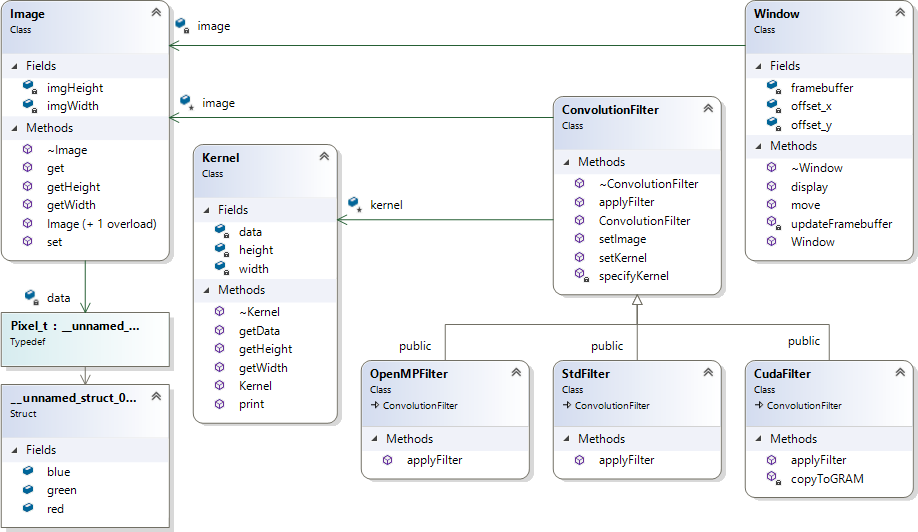

# Convolution Filter

- For displaying result image was used OpenGL library
- Parallelised with OpenMP, [Nvidia Cuda](http://www.nvidia.com/object/cuda_home_new.html) or C++ 11's std::thread


# Implementation


- Convolution filter is implemented as Strategy pattern (ConvolutionFilter), where each of concrete strategies implements different parallelization technology (OpenMPFilter, CudaFilter, StdFilter).
- Pixel_t represents one pixel of image
- Kernel represents convolution filter kernel
- Window encapsulates logic for displaying and navigating in result
- Image encapsulates image data


# Compile on Linux / Unix
1. Install glfw
```
sudo apt-get update
sudo apt-get install libglfw3
sudo apt-get install libglfw3-dev
```
2. Go to source directory
```
cd ".../Image-Processing/ImageProcessing/Convolution Filter"
```
3. Compile
```
g++ `find . -type f -name \*.cpp` `find . -type f -name \*.h` -std=c++14 -lglfw -lGL -lpthread -o ./ConvolutionFilter
```
4. Run
```
./ConvolutionFilter
```