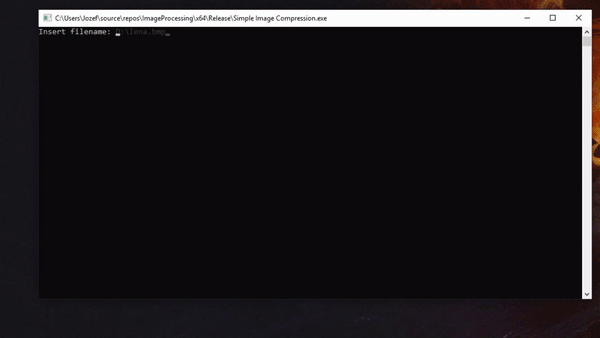
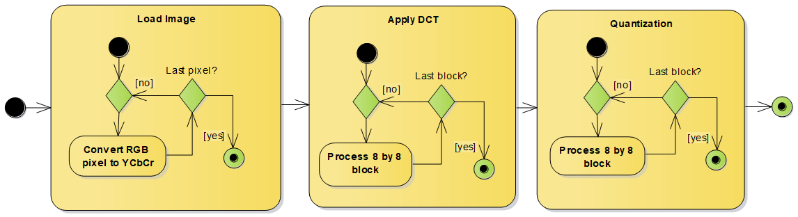
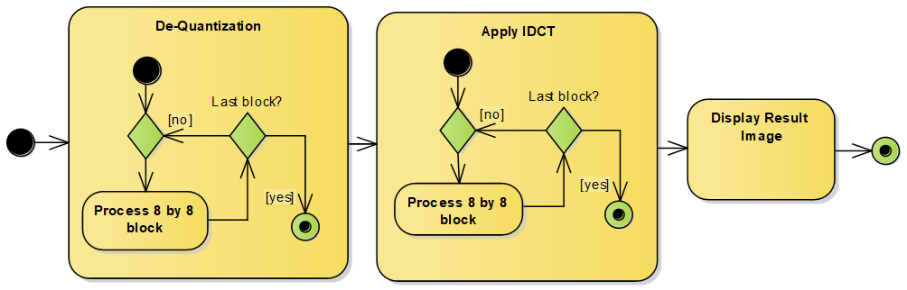
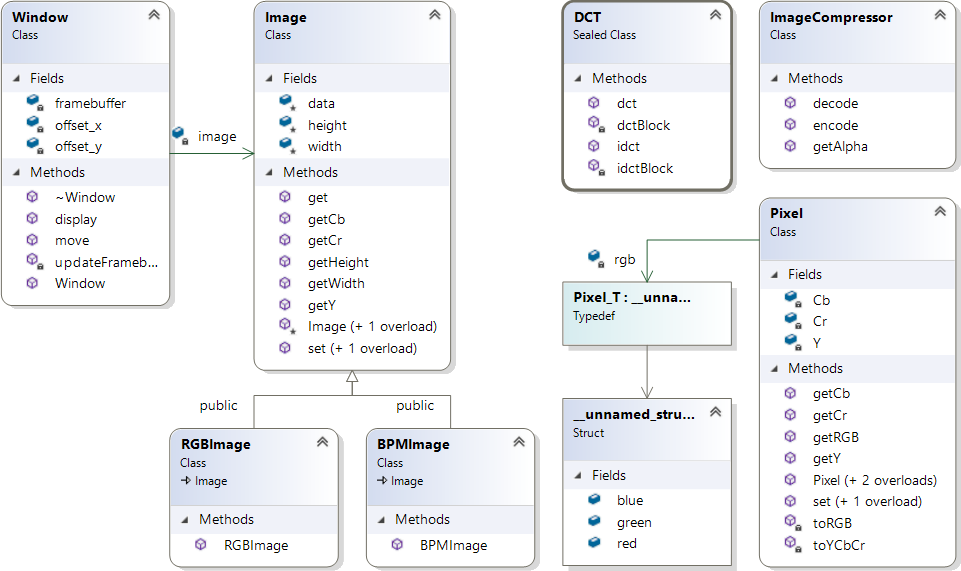
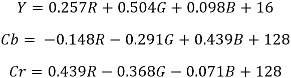
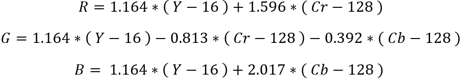
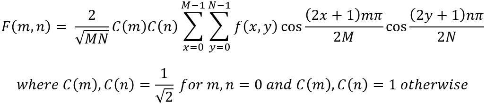
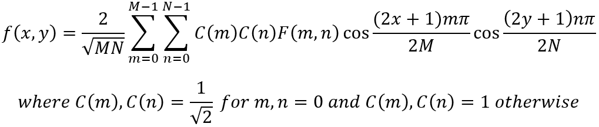

# Simple Image Compression

- Simplified JPEG Compression Algorithm 

## Encoding
1. Loading image (RGB pixels are converted to YCbCr)
2. Split image into 8 by 8 blocks and aply DCT for every block
3. Apply Quantization on every 8 by 8 block

## Decoding
1. Split image into 8 by 8 blocks and aply Dequantization for every block
2. Apply IDCT on every 8 by 8 block
3. Display Result Image

## Class Model

### Pixel
- Stores pixel values in both RGB and YCbCr
- When Pixel value changes, YCbCr / RGB values are automatically updated
- RGB to YCbCr

- YCbCr to RGB

### Image
- Supports loading .rgb or .bpm image formats

## 2-D Discrete cosine transform (DCT)
- Image is split into 8 by 8 blocks
- Calculated for every image block

## 2-D Inverse Discrete cosine transform (IDCT)
- Image is split into 8 by 8 blocks
- Calculated for every image block

