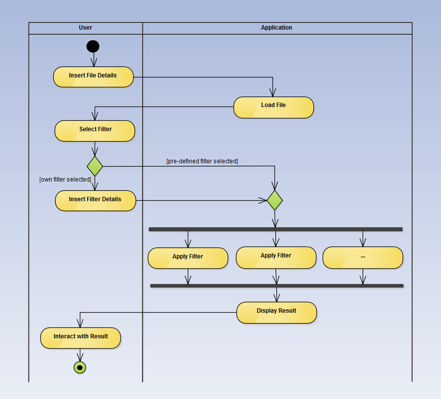

# Convolution Filter

- For displaying result image was used OpenGL library
- Parallelised with OpenMP or [Nvidia Cuda](http://www.nvidia.com/object/cuda_home_new.html)

# Implementation

- Convolution filter is implemented as Strategy pattern (ConvolutionFilter), where each of concrete strategies implements different parallelization technology (OpenMPFilter, CudaFilter).
- Pixel_t represents one pixel of image
- Kernel represents convolution filter kernel
- Window encapsulates logic for displaying and navigating in result
- Image encapsulates image data

